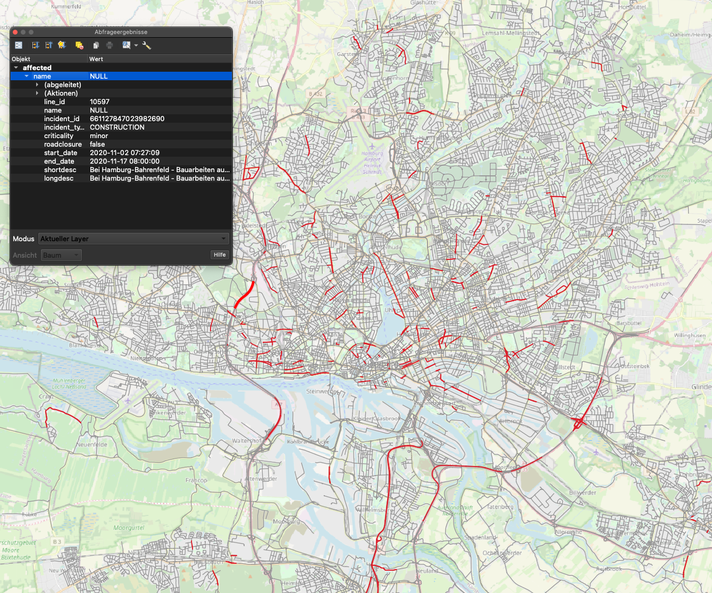

# Here20SM

Reference implementation of the [TomTom OpenLR standard](https://www.openlr-association.com/method.html) to map traffic information provided by the [HERE Traffic API](https://developer.here.com/documentation/traffic/dev_guide/topics/what-is.html) on an OSM road network. The implementation came about as part of a master’s thesis, involving the [HTW Dresden faculty of Geoinformatics](https://www.htw-dresden.de/hochschule/fakultaeten/geoinformation) and the [IVI Dresden](https://www.ivi.fraunhofer.de). 

If you want to view the master's thesis, you can ask the IVI for access.

## Table of Contents
1. [General Info](#general-info)
2. [Programms and accounts needed](#programms)
3. [Database setup](#database_setup)
4. [Build](#build)
5. [Database tables](#tables)
6. [FAQs](#faqs)
7. [Technologies](#technologies)
8. [License](#license)

### General Info
***
Reference implementation implemented in Java. Uses the [TomTom OpenLR standard](https://www.openlr-association.com/method.html) and the [TPEG2-OLR ISO/TS 21219-22 standard](https://www.iso.org/standard/63122.html) to map traffic information on a road network based on [OpenStreetMap](https://www.openstreetmap.org/#map=6/51.330/10.453) data. 

Project status: reference implementation

### Incidents visualized in QGIS



### Programms and accounts needed
***
* At least a [HERE Developer Freemium plan](https://developer.here.com/pricing) with an API KEY for the usage of the [HERE Traffic API](https://developer.here.com/documentation/traffic/dev_guide/topics/what-is.html).

#### Programms
* IDE of your choice, e.g. IntelliJ IDEA
* [PostgreSQL database](https://www.postgresql.org) with [PostGIS](http://postgis.net) extension
* Database client, e.g. DBeaver, pgAdmin 

If you'd like to visualize the affected lines: 
* [QGIS](https://www.qgis.org/de/site/) to visualize the data, however, is not absolutely necessary

If you want to set up a PostgreSQL database with OSM data: 
* [OSM2pgsql](https://osm2pgsql.org)

### Database setup 
***
Check out HOWTO for instructions on setting up a routable PostgreSQL database based on OSM data.

### Build
***
1. Clone project from GitHub
    * [Instruction for IntelliJ](https://blog.jetbrains.com/idea/2020/10/clone-a-project-from-github/) 
2. Change database informtion ***dbname***, ***user*** and ***password*** in:  
    * [DatasourceConfig.java](src/main/java/DataBase/DatasourceConfig.java) 
    * pom.xml
```xml
<!-- JDBC connection parameters -->
<jdbc>
    <driver>org.postgresql.Driver</driver>
    <url>jdbc:postgresql://localhost/dbname</url>
    <user>username</user>
    <password>password</password>
</jdbc>
```

3. Set your [HERE Api key](src/main/java/HereApi/ApiRequest.java)
```java
private String hereApikey = "yourApiKey";
```

4. To build the project
```bash
mvn clean install
```
5. Run the program. The requested bounding must be specified as WGS84 coordinates.

### Databse tables 
***
The database sould contain the following tables before running the programm: 
+ **form_of_way** : physical characteristics of a street. For more informationn check [TomTom OpenLR White Paper](https://www.openlr-association.com/fileadmin/user_upload/openlr-whitepaper_v1.5.pdf).
+ **functional_road_class**: indicates the importance of the road in the network. For more informationn check [TomTom OpenLR White Paper](https://www.openlr-association.com/fileadmin/user_upload/openlr-whitepaper_v1.5.pdf).
+ + **kanten**: lines in the road network. 
+ + **knoten**: nodes in the road network. 
+ **metadata**: metainformation for the map, map owner, map name and bounding box information.


After running the programm the following tables should be added to the databse: 
+ **affected** : contains all lines affected by a incident
+ **incidents** : Contains all incidents received from the Traffic API with their ID, type, status, start date, end date, criticaliy, OpenLR code, short description, detailed description, road closure, positive offset, negative offset and creation date. If a incident couldn't be mapped the offsets are set to -1, if the OpenLR code is not valid they are set to -100. 
+ **kanten_incidents**: key table

### FAQs
***
1. **Is there a database example?**
_Yes, check out the HOWTO file_. 
1. **Can you decode a TomTom OpenLR location?**
_You can find the decoder to be used in the TomTomDecoder class._ 
2. **How do you visualize the data in QGIS?**
_Check this [video](https://www.youtube.com/watch?v=17AZQ2-5Rrk)._
1. **Can I use a different spatial database?** _Yes, it is possible to use another spatial databse. But you need to implement your own map loader using the [MapLoader Interface](src/main/java/Loader/MapLoader.java). In addition, changes in the pom.xml (database connection and Jooq dialect), the DatasourceConfig class and the ApiRequest class must be made._ 

### Technologies
***
* TomTom OpenLR implementation: <https://github.com/tomtom-international/openlr>
* HERE Traffic API: <https://developer.here.com/documentation/traffic/dev_guide/topics/incident-data.html>
* PostgreSQL: <https://www.postgresql.org>
* PostGIS: <https://postgis.net>
* pgRouting: <https://pgrouting.org>
* jOOQ: <https://www.jooq.org>


### License
***
[Apache License, Version 2.0](http://www.apache.org/licenses/LICENSE-2.0.html)
