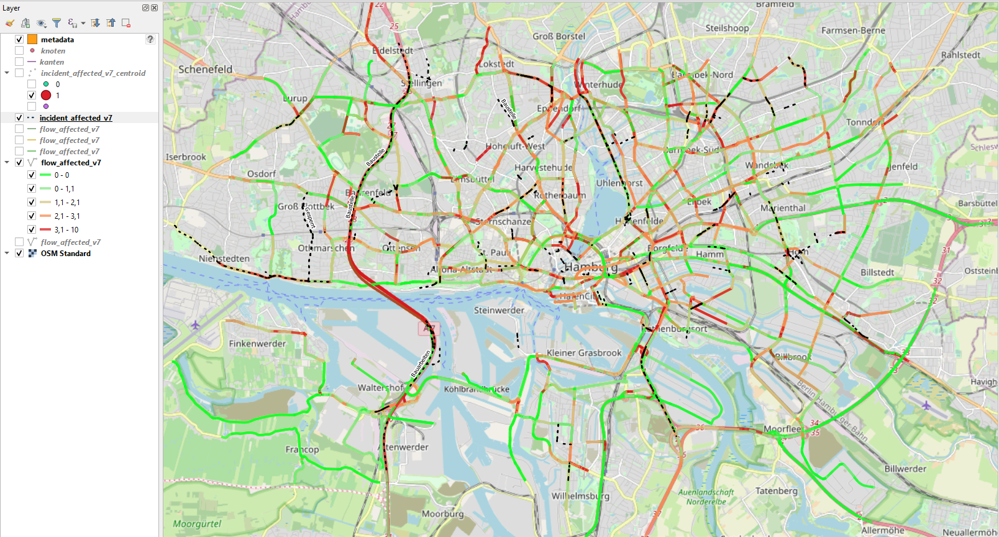
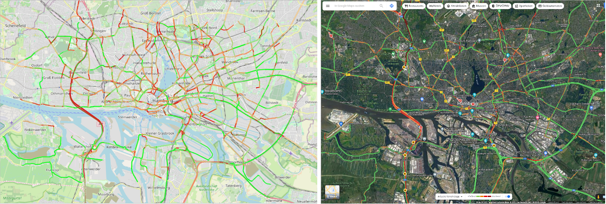

# Here20SM

Reference implementation of the [TomTom OpenLR standard](https://www.openlr-association.com/method.html) to map traffic information provided by the [HERE Traffic API](https://developer.here.com/documentation/traffic/dev_guide/topics/what-is.html) on an OSM road network. The implementation came about as part of a master’s thesis, involving the [HTW Dresden faculty of Geoinformatics](https://www.htw-dresden.de/hochschule/fakultaeten/geoinformation) and the [IVI Dresden](https://www.ivi.fraunhofer.de). 

If you want to view the master's thesis, you can ask the Fraunhofer IVI for access.

## Index
1. [General Info](#general-info)
2. [Setup](#setup)
3. [Database tables](#database-tables)
4. [FAQs](#faqs)
5. [Technologies](#technologies)
6. [License](#license)

### General Info
***
Reference implementation in Java. Uses the [TomTom OpenLR standard](https://www.openlr-association.com/method.html) and the [TPEG2-OLR ISO/TS 21219-22 standard](https://www.iso.org/standard/63122.html) to map traffic information on a road network based on [OpenStreetMap](https://www.openstreetmap.org/#map=6/51.330/10.453) data. 

***

QGIS visualization

Flow data compared to Google's

### Setup
***
See [SETUP](SETUP.md) for instructions on how to get the project components up and running.

### Database tables 
***
The database should contain the following tables before running the program: 
+ **form_of_way:** physical characteristics of a street. For more information check [TomTom OpenLR White Paper](https://www.openlr-association.com/fileadmin/user_upload/openlr-whitepaper_v1.5.pdf).
+ **functional_road_class:** indicates the importance of the road in the network. For more information check [TomTom OpenLR White Paper](https://www.openlr-association.com/fileadmin/user_upload/openlr-whitepaper_v1.5.pdf).
+ **kanten:** lines in the road network. 
+ **knoten:** nodes in the road network. 
+ **metadata:** metainformation for the map, map owner, map name and bounding box information.

After running the program the following tables should be added to the database:
+ **flow_v7:** shows information about traffic flow
+ **flow_affected_v7:** contains all lines affected by flow
+ **incidents_v7:** shows information about incidents 
+ **incident_affected_v7:** contains lines affected by incidents
+ **kanten_flow_v7:** key table
+ **kanten_incidents_v7:** key table

For more detailed information see [TABLES](TABLES.md)

### FAQs
***
1. **Is there a database example?**
_Yes, check out [SETUP](SETUP.md)._
2. **Can you decode a TomTom OpenLR location?**
_You can find the decoder to be used in the TomTomDecoder class._ 
3. **How do you visualize the data in QGIS?**
_Check this [video](https://www.youtube.com/watch?v=17AZQ2-5Rrk)._
4. **Can I use a different spatial database?** _Yes, it is possible to use another spatial database. But you need to implement your own map loader using the [MapLoader Interface](src/main/java/Loader/MapLoader.java). In addition, changes in the pom.xml (database connection and Jooq dialect), the DatasourceConfig class and the ApiRequest class must be made._ 

### Technologies
***
* TomTom OpenLR implementation: <https://github.com/tomtom-international/openlr>
* HERE Traffic API: <https://developer.here.com/documentation/traffic/dev_guide/topics/incident-data.html>
* PostgreSQL: <https://www.postgresql.org>
* PostGIS: <https://postgis.net>
* pgRouting: <https://pgrouting.org>
* jOOQ: <https://www.jooq.org>

### License
***
[Apache License, Version 2.0](http://www.apache.org/licenses/LICENSE-2.0.html)
