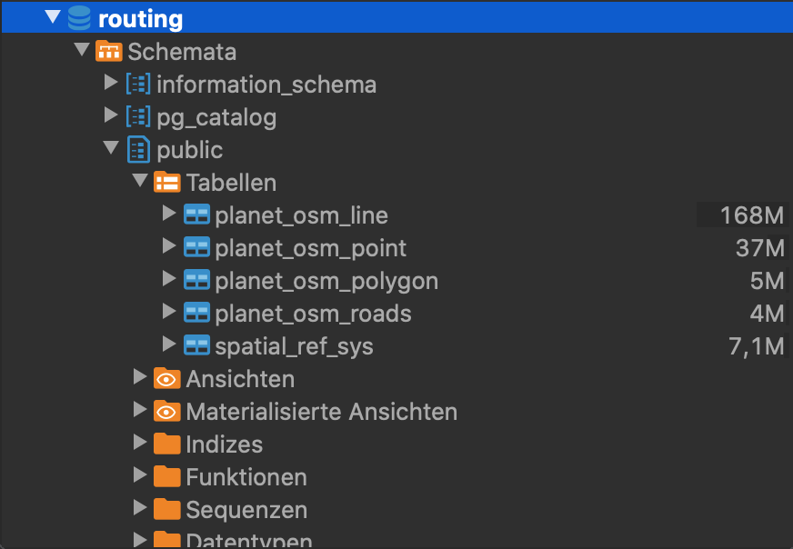

# Setup

This setup guides you through the installations needed to run Here2OSM.
Examples are for Windows(x64).

## Index
1. [IDE](#IDE)
2. [QGIS](#QGIS)
3. [PostgreSQL](#PostgreSQL)
4. [Database client](#database-client)
5. [HERE-Api-Key](#HERE-Api-Key)
6. [osm2pgsql](#osm2pgsql)
7. [OSM data](#OSM-data)
8. [Database setup](#database-setup)
9. [Maven](#Maven)
10. [Build](#Build)


### IDE
This code works best with [IntelliJ](https://www.jetbrains.com/de-de/idea/download/#section=windows), but feel free to use your favourite IDE. You should use a JDK >= 11.

### QGIS
* QGIS is free and open source geographic information system, which is used to visualise test data
* Download [QGIS](https://www.qgis.org/en/site/forusers/download.html) and install
* Choose the matching download for your system, e.g. if you are on a Windows machine, use the first Link under *Download for Windows*

### PostgreSQL
* Download and Install PostgreSQL with PostGIS and pgrouting extension: [PostgreSQL](http://download.osgeo.org/postgis/windows/pg14/)
  * Alternatively: Download and install [PostgreSQL](https://www.enterprisedb.com/downloads/postgres-postgresql-downloads)
  * Click the first Link in the Windows column
  * In the Application Stack Builder during installation of PostgreSQL, choose your PostgreSQL > install the latest PostGIS Bundle (under *Spatial Extensions*)

### Database client
Download and install [DBeaver](https://dbeaver.io/download/)
* Take the 64 bit installer under *Windows*

### [HERE-Api-Key](https://developer.here.com/pricing)
* Sign up for Freemium Plan
* Create a REST API Key
* Create a `credentials.properties` file as described in the section identity & access management (OAuth tokens)

### [osm2pgsql](https://osm2pgsql.org/doc/install.html#installing-on-windows)
* Download the prebuild binaries (*osm2pgsql-latest-x64.zip*)
* extract the zip and copy the Path to the bin folder
* Add the bin to your Path
    * type "View advanced system Settings" in the Start Menu and open it
    * click *Environment Variables* in the bottom right, than *Path* in the top  List and *Edit*
    * click *new* in the top right and paste the Path you copied earlier
    * click *ok* on all opened Windows

### [OSM data](https://download.geofabrik.de/)
* Download an osm *.pbf file of your choice
* It is highly recommended to just get a city-file for beginners, e.g. [hamburg-latest](https://download.geofabrik.de/europe/germany/hamburg-latest.osm.pbf)

### Database setup
* Create the data base
    * Start DBeaver 
    * click *New Connection* (top left) and choose *PostgreSQL*, than *Next*
    * insert your PostgreSQL-Password and click *Done*
* Add extensions
    * under *postgres\DB's* doubleclick *postgres*
    * click *SQL* (next to *New Connection*) and write
    ```sql
    create extension postgis;
    create extension pgrouting;
    create extension hstore;
    ```
    * run the script with *run SQL script* (third button to the left)
* Transfer the osm data into DB
    * execute in Command Prompt:
    ```bash
    osm2pgsql -c -d postgres -U postgres -H localhost -W --hstore -S <Path to>\osm2pgsql-bin\default.style <Path to>\<filename>.osm.pbf
    ```
    * remember to use quotation marks around paths with Spaces.

Now you should have these public tables:



* Run one of these two scripts in your DB client to generate a routable OSM road network:
    * If you want to use **all of the OSM** data use [This](src/main/resources/SQL/SQL_Script.sql)
    * If you want to **clip the data to an area** use [That](src/main/resources/SQL/SQL_Script_clip2bbox.sql)
        * The clipping area has to be in YourDB\schemas\public\tables and named **bbox**.
    * **Before running** set the informations **map_name** and **map_owner** in the fourth last statement (line 209+):
```sql
INSERT INTO openlr.metadata(map_name, map_owner) VALUES
('Hamburg', 'OSM');
```

After running your database should look as follows:


### [Maven](https://maven.apache.org/download.cgi)
* Under *Files* click the Binary zip archive Link and unzip the Downloaded archive
* Add to your Environment Variables:
    * *Variable name:* MAVEN_HOME *value:* **PathTo**\apache-maven-x.x.x
    * %MAVEN_HOME%\bin to the Path variable

### Build
* Clone this project
    * Fork it **(optional)**
    * click *Code* (green button) and copy the HTTP-Adress
    * In a Command Prompt navigate to a location you want the project in and execute
    ```bash
    git clone <HTTP-Adress>
    ```
* Set your **dbname**, **user** and **password** at **src\main\java\DataBase\DatasourceConfig.java** (line 23+2) and **pom.xml** (line 236+2)
* go back to the Command Prompt and execute
```bash
cd openlr
```
```bash
mvn clean install
```
Copy the already generated `credentials.properties` file to the subfolder `target` of the project.

Move to the subfolder `target` and run from there:
```bash
java -jar here2osm.jar
```
* supply the bounding box of your chosen region in the format: SW Long,SW Lat,NE Long,NE Lat (counterclockwise) hamburg for example has 9.850,53.500,10.130,53.600
  
